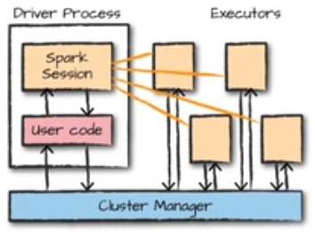
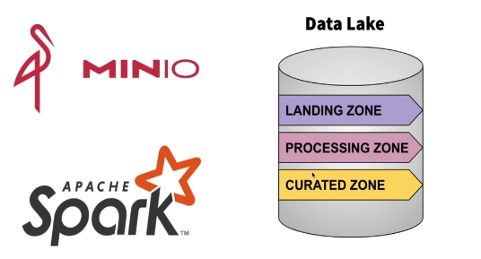
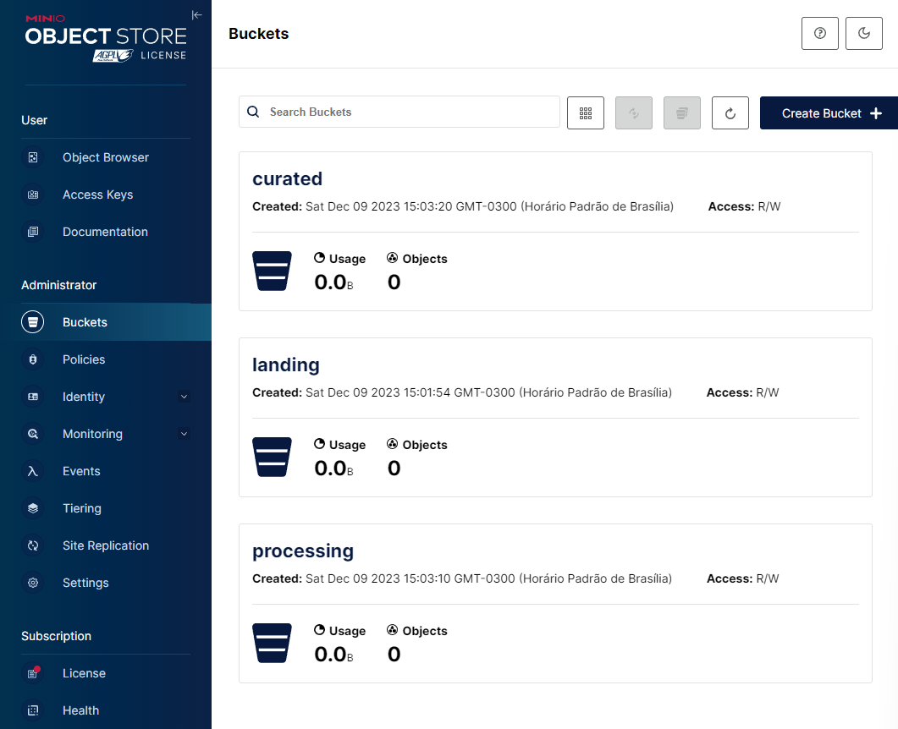
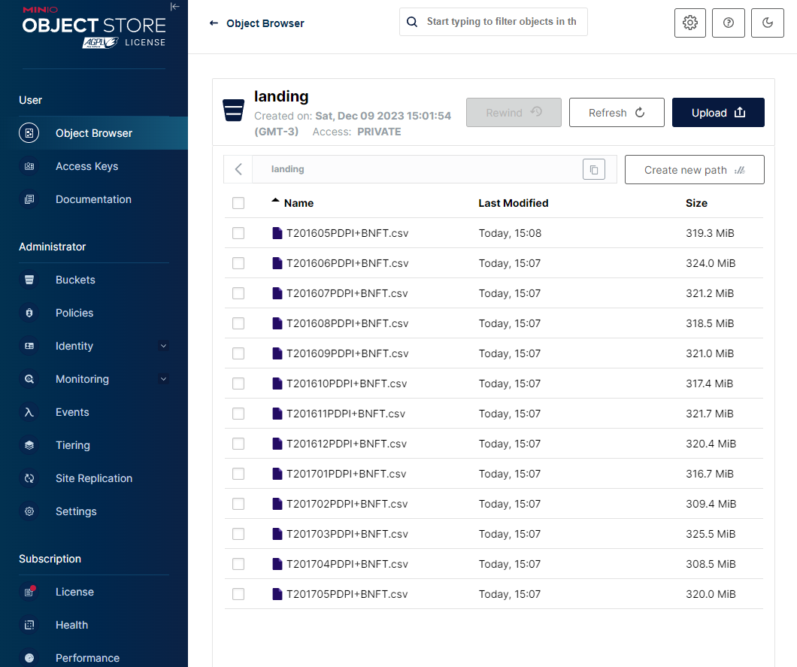

# Trabalhando-com-Spark
Neste repositório trabalharemos com processamento de dados usando Spark.

Primeiro iremos entrar com uma base teórica, depois vamos para implementação de um projeto.

## Tabela de Conteúdo

- [Processamento em Batch](#Processamento-em-Batch)
- [Processamento em Streaming](#Processamento-em-Streaming)
- [Arquiteturas de Processamento de Dados em Larga Escala](#Arquiteturas-de-Processamento-de-Dados-em-Larga-Escala)
- [Introdução ao Apache Spark](#Introdução-ao-Apache-Spark)
- [DataBricks](#DataBricks)
- [Fazendo Upload do Dataset no DataBricks](#Fazendo-Upload-do-Dataset-no-DataBricks)
- [Formato Parquet](#Formato-Parquet)
- [Convertendo arquivos CSV para Parquet com Spark](#Convertendo-arquivos-CSV-para-Parquet-com-Spark)
- [Arquitetura e modos de Deploy do Spark](#Arquitetura-e-modos-de-Deploy-do-Spark)
- [Executando uma aplicação Spark](#Executando-uma-aplicacão-Spark)
- [Criando um ambiente local](#Criando-um-ambiente-local)

## Processamento em Batch

O processamento em Batch envolve a execução de operações em um conjunto fixo de dados, coletados ao longo de um período de tempo. Ao contrário do processamento em streaming, em que os dados são processados em tempo real, o processamento em lote lida com volumes de dados maiores, geralmente em intervalos programados.

### Exemplo Prático

Suponha que esteja analisando dados de vendas de uma loja online. Com o processamento em batch, poderíamos executar análises diárias ou semanais, processando todas as transações acumuladas nesse período. Isso é útil para relatórios periódiocos, geração de insights hitóricos e otimização de recusos.

### Características Principais:

- **Eficiência:** Adequado para grandes volumes de dados que podem ser processados de uma vez

- **Planejamento:** As operações são programadas para serem executadas em intervalos específicos.

### Conclusão

O processamento em Batch é eficaz para tarefas que não exigem resposta em tempo real e permite o processamento eficiente de grandes conjuntos de dados em momentos específicos. É comumente utilizado em cenários que demandam análises retrospectivas e relatórios periódicos.

## Processamento em Streaming

O processamento em streaming é uma abordagem dinâmica para lidar com dados em tempo real. Ao contrário do processamento em lote, onde os dados são processados em grupos, o streaming permite a análise contínua à medida que os dados são gerados.

### Exemplo Prático

Imagine um app de análise de redes sociais que atualiza em tempo real a contagem de likes ou retweets. Com o processamento em streaming, cada interação do usuário é processada assim que ocorre, permitindo uma exibição em tempo real das métricas de engajamento.

### Características Principais:

- **Latência Baixa:** Respostas quase instantâneas às mudanças nos dados.

- **Monitoramento Contínuo:** Ideal para sistemas que exigem atualizações constantes.

- **Detecção de Padrões em Tempo Real:** Permite identificar tendências e eventos imediatamente. 

### Conclusão

O processamento em streaming é essencial para cenários onde a análise em tempo real é crucial, como monitoramento de Iot, análise de dados de tráfego na web ou detecção de froudes em transações financeiras.

## Arquiteturas de Processamento de Dados em Larga Escala.

As arquiteturas Lambda e Kappa são duas abordagens distintas para projetar sistemas de processamento de dados em larga escala, especialmente em ambientes onde há necessidade de lidar com grandes volumes de dados. Vamos explorar cada uma delas e destacar as diferenças.

### Arquitetura Kappa

A arquitetura Kappa é um modelo de arquitetura para sistemas de processamento de dados em tempo real. Ela foi proposta como uma alternativa à arquitetura Lambda, simplificando o design e mantendo a capacidade de lidar com fluxos contínuos de dados.

#### Características Principais da Arquitetura Kappa

- **Unified Stream Processing:** Diferentemente da arquitetura Lambda, que separa o processamento em lote e em tempo real, a arquitetura Kappa unifica ambos sob um único sitema de processamento de stream.

- **Simplicidade:** A principal ideia por trás da arquitetura Kappa é simplificar a infraestrutura, removendo a necessidade de ter sistemas distintos para processamento em lote e em tempo real.

- **Processamento de Eventos:** O processamento de eventos é o foco principal. Todos os dados, incluindo dados históricos, são tratados como eventos de streaming contínuo.

- **Imutababilidade:** Os dados são considerados imutáveis. Em vez de atualizar registros existentes, novos ecentos são adicionados ao stram, facilitando a escalabilidade e a consistência.

#### Para que serve a Arquitetura Kappa.

Essa arquitetura é especialmente útil em casos em que:

- **Baixa Latência é Crucial:** Situações em que a necessidade de resposta em tempo real é fundamental, como em sistemas de monitoramento, análise de tráfego em tempo real ou detecção de fraudes.

- **Simplicidade é Prioridade:** Projetos que buscam uma arquitetura mais simples e menos complexa, evitando a necessidade de gerenciar sistemas separados para processamento em lote e em tempo real.

- **Escalabilidade é Necessaria:** Aplicações que precisam escalar facilmente para lidar com volumes crescentes de dados, aproveitando a natureza distribuída do processamento de streaming.

#### Exemplo:

#### Conclusão:

A arquitetura Kappa, ao focar em processamento de eventos em tempo real e simplificar a infraestrutura, é adequada para casos de uso que demandam agilidade, baixa latência e capacidade de expansão em ambientes dinâmicos de dados.

### Arquitetura Lambda

A arquitetura Lambda foi proposta para lidar com as limitações encontradas em sistemas de processamento em tempo real, reconhecendo a importância de ter uma camada de processamento em lote para tarefas como ETL (extração, transformação e carga) e processamento histórico.

#### Características Principais da Arquitetura Kappa

- **Camadas Distintas:** Divide o processamento de dados em duas camadas principais: a camada de batch (em lote) e a camada de stream (em tempo real).

- **Processamento em Lote::** Utiliza sistemas de processamento em lote para análises históricas e ETL, garantindo a consistência e confiabilidade dos dados.

- **Processamento em Tempo Real:** Incorpora um sistema de processamento de stream para lidar com dados em tempo real, permitindo análises em tempo real e respostas a eventos instantâneas.

#### Para que serve a Arquitetura Lambda.

- **Necessidade de Análises Históricas::** Quando é necessário analisar grandes volumes de dados históricos.

- **Garantia de Consistência::** Em cenários em que a consistência entre dados históricos e em tempo real é crítica.

- **Suporte a ETL Complexo::** Para processar dados brutos e transformá-los em formatos mais úteis.

#### Exemplo:

#### Conclusão:

A escolha entre arquitetura Lambda e Kappa dependerá das necessidades específicas do projeto, priorizando fatores como latência, consistência, complexidade e tipo de análise de dados realizada.

## Introdução ao Apache Spark.

O Apache Spark é um poderoso framework open source para processamento de dados distribuído e escalável. Projetado para oferecer alto desempenho e facilidade de uso, o Spark é amplamente utilizado em diversas aplicações de processamento de dados em larga escala. Aqui estão algumas características e conceitos-chave relacionados ao Apache Spark:

- **Processamento em Memória:** O Spark é conhecido por seu modelo de processamento em memória, que permite armazenar dados na RAM, proporcionando um processamento significativamente mais rápido em comparação com sistemas que dependem principalmente de disco.

- **APIs Abertas:** Oferece APIs em várias linguagens, incluindo Scala, Java, Python e R, o que facilita a integração com diferentes ecossistemas e permite que os desenvolvedores escolham a linguagem de programação de sua preferência.

- **Resiliente e Tolerante a Falhas:** O Spark é projetado para ser tolerante a falhas e resiliente. Se ocorrerem falhas em um nó, o Spark pode recuperar os dados perdidos automaticamente, garantindo a continuidade do processamento.

- **DAG (Directed Acyclic Graph):** O Spark executa operações em um grafo acíclico direcionado (DAG), permitindo a otimização das operações. As transformações são planejadas e otimizadas antes da execução real.

- **Módulos e Bibliotecas:** Além do processamento de dados em lote (Batch Processing), o Spark oferece módulos para processamento de stream em tempo real (Structured Streaming), aprendizado de máquina (MLlib), processamento de gráficos (GraphX) e consultas SQL (Spark SQL).

- **Suporte a Diversas Fontes de Dados:** O Spark suporta várias fontes de dados, incluindo Hadoop Distributed File System (HDFS), Apache Cassandra, Apache HBase, Amazon S3, entre outras, tornando-o flexível para integração com diversos sistemas de armazenamento.

- **Cluster Manager:** Pode ser executado em diversos gerenciadores de cluster, como Apache Mesos, Hadoop YARN e o gerenciador de cluster próprio chamado Spark Standalone.

## DataBricks.

Databricks é uma plataforma de análise de dados baseada em nuvem, centrada no suporte ao Apache Spark. Oferece um ambiente colaborativo de notebook interativo para cientistas de dados e engenheiros trabalharem juntos. Além do processamento em lote, suporta processamento de stream em tempo real. Integra-se a ecossistemas de dados, como Delta Lake e serviços de nuvem. Fornece automação, segurança avançada, escalabilidade na nuvem e recursos integrados de machine learning. É agnóstico de nuvem, oferecendo suporte a AWS, Azure e Google Cloud. Databricks é amplamente utilizado para análise de dados e desenvolvimento de big data na nuvem.

### Criando uma conta no DataBricks.

Crie uma conta no dataBricks utilizando a opção community cloud. 

### Criando cluster no DataBricks

Crie um cluster na plataforma, acessando na barra lateral a opção `+` logo em seguida `Cluster` como no print:

Compute name: `cluster_spark_1`
Databricks runtime version: `Runtime: 13.1 ML`

Clique em create cluste e aguarde alguns minutos.

### Criando pastas e fazendo upload de um notebook

Crie uma pasta no workspace:

Coloque o arquivo Scripts_1 nesta pasta(arquivo na pasta files do repositório).

Já voltaremos a essa prática, porém é necessário o entendimento de alguns conceitos:

#### Dataframes no Apache Spark:

##### O que são:

DataFrames são estruturas de dados tabulares distribuídas no Apache Spark. Eles são semelhantes a tabelas em um banco de dados relacional ou a DataFrames em linguagens como o pandas em Python.

##### Características:

Os DataFrames no Spark são imutáveis e são construídos a partir de RDDs (Resilient Distributed Datasets). Eles oferecem uma API rica e expressiva para consultas e transformações de dados.

##### Operações:

Permitem realizar operações como filtros, projeções, junções e agregações em larga escala. As operações em DataFrames são otimizadas pelo Spark Catalyst Optimizer, que planeja e executa consultas de forma eficiente.

##### Linguagens de Programação:

Pode ser utilizado por meio de APIs em linguagens como Scala, Java, Python e R.

#### Partições no Apache Spark:

##### O que são:

Partições referem-se à divisão lógica de um DataFrame ou RDD em partes menores. Cada partição contém uma porção dos dados distribuídos no cluster.

##### Importância:

Partições são essenciais para o processamento paralelo distribuído. Elas permitem que o Spark processe diferentes partes dos dados simultaneamente em diferentes nós do cluster, melhorando a escalabilidade e o desempenho.

##### Número de Partições:

O número de partições pode ser configurado e é crucial para otimizar o desempenho. Um número adequado de partições equilibra a carga entre os nós do cluster, evitando gargalos de processamento.

##### Métodos de Controle:

O desenvolvedor pode controlar o número de partições ao criar um DataFrame ou RDD, ou o Spark pode inferir automaticamente o número de partições com base no número de núcleos disponíveis no cluster.

#### Boas Práticas para gestão de Data Lakes.

Em um contexto de Data Lake, as "zonas" referem-se a áreas ou seções distintas dentro do armazenamento de dados, cada uma servindo a um propósito específico no gerenciamento e organização dos dados. Essas zonas são frequentemente usadas para impor políticas de governança, segurança e gerenciamento de dados em um ambiente de Data Lake. Vamos explorar algumas zonas comuns em um Data Lake:

##### 1. Raw Zone (Zona Bruta):
A zona bruta é a área onde os dados crus ou brutos são inicialmente armazenados sem muita transformação. Este é o local onde os dados recém-ingestados são depositados antes de passar por qualquer processo de transformação ou limpeza.

##### 2. Staging Zone (Zona de Estágio):

A zona de estágio é onde os dados crus da zona bruta são preparados para processamento adicional. Isso pode incluir tarefas como limpeza de dados, validação e conversão de formatos.

##### 3. Curated (ou Refined) Zone (Zona Refinada):

A zona refinada, os dados são transformados e refinados para atender a requisitos específicos de negócios. Pode incluir a aplicação de esquemas definidos, agregações e estruturação dos dados.

##### 4. Consumption (ou Serving) Zone (Zona de Consumo):

A zona de consumo é a área onde os dados refinados são disponibilizados para usuários finais, aplicações ou ferramentas de análise. É a camada final onde os dados são consumidos para insights, relatórios ou outras finalidades.

##### 5. Backup Zone (Zona de Backup):

A zona de backup é reservada para cópias de segurança ou réplicas de dados críticos presentes em outras zonas. Essa área ajuda a garantir a recuperação de dados em caso de falhas ou perdas.

## Fazendo Upload do Dataset no DataBricks.

Como foi descrito acima das zonas de dataLakes, elas nada mais são que repositórios especificos dentro do cloud.

Faça o Download dos arquivos no primeiro link do notebook. Iremos fazer o upload apenas dos arquivos com a nomeclatura `T2.....`

Na aba lateral clique em `Data`.

Após clique em `Create Table`.

De o nome do diretório de `RawData`(não se esqueça de criar esse diretório).

Faça o upload de cada tabela individual

Siga os passos do notebook até `df.count()`

## Formato Parquet

O Parquet é um formato de armazenamento de dados colunar de código aberto que foi projetado para ser eficiente em termos de leitura, compacto e compatível com uma variedade de frameworks de processamento de dados, incluindo Apache Spark, Apache Hive, Apache Impala e muitos outros. Aqui estão algumas características-chave do formato de dados Parquet:

### 1. Colunar:

O Parquet armazena dados de maneira colunar, o que significa que os valores de uma coluna específica são armazenados juntos, em oposição ao armazenamento por linhas. Isso melhora significativamente a eficiência em operações de leitura que envolvem a seleção de um subconjunto de colunas.

### 2. Compacto:

O formato Parquet é altamente compacto, pois utiliza técnicas como compressão de dados e codificação de dicionário para reduzir o tamanho dos arquivos. Isso resulta em economia de espaço em disco e menor uso de largura de banda durante a transferência de dados.

### 3. Esquema Evolutivo:

O Parquet suporta um modelo de esquema evolutivo, o que significa que você pode adicionar, remover ou modificar colunas sem afetar a compatibilidade com versões anteriores dos dados. Isso é crucial para a evolução contínua dos dados ao longo do tempo.

### 4. Suporte a Tipos Complexos:

Além de tipos simples como inteiros e strings, o Parquet suporta tipos de dados complexos, como listas, mapas e estruturas aninhadas. Isso permite a representação eficiente de estruturas de dados complexas.

### 5. Particionamento e Filtragem Eficientes:

Como os dados são armazenados colunarmente, o Parquet facilita operações de particionamento e filtragem, onde apenas os blocos de dados relevantes para a consulta são lidos, resultando em operações mais eficientes.

### 6. Suporte a Várias Plataformas:

O formato Parquet é suportado por uma variedade de ecossistemas e frameworks, tornando-o uma escolha versátil para armazenamento e processamento de dados em ambientes distribuídos.

### 7. Suporte a Várias Plataformas:

Os dados no formato Parquet são frequentemente comprimidos, usando algoritmos como Snappy, Gzip ou outros, para reduzir o espaço de armazenamento e acelerar a transferência de dados.

### 8. Porque usar Parquet e não csv:

A imagem abaixo uma comparação entre o uso do PARQUET e CSV na Amazon. Olhe a diferença absurda:

Em resumo, o formato Parquet é uma escolha eficiente para armazenar grandes volumes de dados em ambientes de big data. Seu design colunar, compactação eficiente e suporte a esquemas evolutivos o tornam uma opção popular em ecossistemas como o Apache Spark e o Hive.

## Convertendo arquivos CSV para Parquet com Spark

Siga os passos do notebook (lembre de criar um diretório chamado `processing`)

Siga até o final do notebook. 

Note a diferença do tempo de processamento e o tamanho dos arquivos.

## Arquitetura e modos de Deploy do Spark

A arquitetura do Apache Spark é baseada no conceito de um cluster distribuído. Um cluster Spark consiste em um nó mestre (Master Node) e vários nós de trabalho (Worker Nodes). O nó mestre gerencia a distribuição de tarefas e monitora o progresso, enquanto os nós de trabalho executam as tarefas.

### Componentes Principais:

#### 1. Driver Program:

É o programa principal que contém a lógica da aplicação Spark. Ele se comunica com o Cluster Manager para alocar recursos e distribuir tarefas.

#### 2. Cluster Manager:

Gerencia os recursos do cluster, alocando tarefas para os nós de trabalho. Pode ser o gerenciador integrado do Spark (chamado Standalone), Apache Mesos ou Apache Hadoop YARN.

#### 3. Executor:

São processos em execução em nós de trabalho que realizam as tarefas específicas da aplicação Spark. Cada aplicação tem seus próprios executores.

#### 4. Contextos:

Spark suporta vários contextos, como SparkContext para tarefas em lote, SQLContext para consultas SQL e StreamingContext para processamento em tempo real.

#### 5. Figura resumo:

### Modos de Deploy do Apache Spark:

#### 1. Modo Local:

Útil para desenvolvimento e teste em uma única máquina. O Spark é executado em um único processo e aproveita todos os núcleos disponíveis.

#### 2. Modo Standalone:

O Spark possui seu próprio gerenciador de cluster (standalone). Cada nó do cluster executa um processo mestre e executores Spark.

#### 3. Modo Cluster:

Pode ser integrado com gerenciadores de cluster externos, como Apache Mesos ou Hadoop YARN. Neste modo, o Spark utiliza os recursos do cluster para execução distribuída.

#### 4. Modo Cliente e Modo Cluster:

No modo Cliente, o driver é executado no ambiente do usuário que inicia o aplicativo, enquanto no modo Cluster, o driver é executado no ambiente do cluster.

#### 5. Apache Hadoop YARN:

O Spark pode ser implantado em um cluster Hadoop usando o YARN como gerenciador de recursos. Isso permite a coexistência com outros frameworks do ecossistema Hadoop.

#### 6. Integração com Armazenamento em Nuvem:

O Spark pode ser configurado para acessar e processar dados diretamente em armazenamentos em nuvem, como Amazon S3 ou Azure Data Lake Storage.

## Executando uma aplicação Spark

O spark-submit é um script do Apache Spark que facilita a submissão de aplicativos Spark para execução em um cluster. Ele é usado para enviar seu código Spark, escrito em Scala, Java, Python ou R, para execução em um ambiente distribuído. Aqui estão alguns conceitos-chave relacionados ao spark-submit:

### 1. Objetivo:

O spark-submit é utilizado para submeter aplicações Spark para execução em um cluster. Ele pode ser usado para executar tanto aplicativos Spark em lote quanto aplicativos Spark Streaming.

### 2. Parâmetros Principais:

- **Classe Principal (--class):** Especifica a classe principal do aplicativo Spark.
- **Arquivo Jar (--jar):** Caminho para o arquivo JAR contendo o código do aplicativo.
- **Modo de Execução (--deploy-mode):** Pode ser "client" (modo cliente) ou "cluster" (modo cluster).
-**Número de Executores (--num-executors):** Define o número de executores a serem alocados no cluster.

### 3. Modos de Execução:

- **Modo Cliente (--deploy-mode client):** O driver é executado no ambiente do usuário que inicia o spark-submit.
- **Modo Cluster (--deploy-mode cluster):** O driver é executado no ambiente do cluster.

### 4. Modos de Execução:

O spark-submit é compatível com vários gerenciadores de recursos, incluindo o gerenciador de cluster Standalone do Spark, Apache Mesos e Apache Hadoop YARN.

### 5. Configurações Adicionais:

É possível passar configurações adicionais para o Spark através do spark-submit, como configurações específicas do Spark (--conf), opções de execução (--executor-memory, --driver-memory), entre outras.

### 6. Logs e Monitoramento:

O spark-submit gera logs que são úteis para monitorar o progresso e diagnosticar problemas durante a execução do aplicativo.

### 7. Boas práticas:

O que é crítico em uma aplicação Spark?

Vamos lembrar que o Spark é uma engine de processamento de dados. Ou seja, o spark nada mais é que uma entrada, processamento e saída.

Podemos então separar em três tarefas basicas: Leitura , Processamento e Saída. 

No primeiro passo, se lermos de uma fonte lenta é um problema pois ele utilizará o disco como cache. É ideal que o spark leia de um data lake com midia rábida como storage. 

Além de ler de forma distribuida , ele escreve de forma distribuida, então devemos no atentar a forma de escrita do banco de dados. 

## Criando um ambiente local

Iremos fazer um ambiente on-premises para processamento de dados.

### 1- Instalando MiniO

- Utilize o PoweSheel e execute os seguintes comandos:

`PS> Invoke-WebRequest -Uri "https://dl.min.io/server/minio/release/windows-amd64/minio.exe" -OutFile "C:\minio.exe" `

`setx MINIO_ROOT_USER admin`

`setx MINIO_ROOT_PASSWORD password`

- Vá ao cmd e vá até o diretório `C:`

- Execute o camando abaixo:

`.\minio.exe server C:\minio --console-address :9090`

Acesse o endereço local: http://127.0.0.1:9090/

Caso não tenha rodado , acesse o site: https://min.io/

Veja a documentação: https://min.io/docs/minio/windows/index.html

### 2 - Criando um Bucket

Vamos criar nossa primeira zona do DataLake: A landing. Crie um Bucket chamado landing, processing, curated

### 3 - Subindo o arquivo para bucket

Suba os arquivos da kaggle no bucket de landing. Clique no bucket e vá ate a pasta de arquivos. 

### 4 - Instalando o Spark o Spark Localmente

Siga o passo a passo do vídeo no link abaixo: 
https://www.youtube.com/watch?v=FIXanNPvBXM

### 5 - Fazendo o Setup do Spark no Visual Studio

Faça a configuração do seu Visual Studio para utilizar o spark. Indo em `File` - > `Preferences` -> `Setings` -> Pesquise por `env` -> selecione seu sistema operacional -> `"SPARK_HOME":"C:/BigDataLocalSetup/spark-3.5.0"`

### 6 - Script

Rode o script na pasta files com seguinte comando:

`spark-submit --name job1-stack-app job-1-spark.py --verbose`

Veja o spark fazendo todo trabalho.

